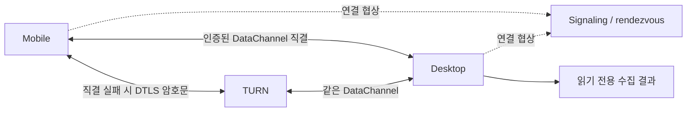

# 결정 로그

매니페스트가 "무엇을 만드는가"라면, 이 파일은 "왜 그렇게 정했는가"다.
번복하고 싶어질 때 먼저 읽으라고 남긴다.

---

## D1. 세션을 실행하지 않고 관찰만 한다

**대안:** orca·agent-deck처럼 세션의 소유자가 되어 tmux/worktree를 관리한다.

**선택:** 관찰만. 파일시스템은 읽기 전용으로만 접근.

**근거:** 소유자가 되면 메타데이터는 풍부해지지만, 사용자가 기존 워크플로를 버리고 이 도구를 통해 에이전트를 띄워야 한다. 소유권을 포기하는 대신 설치 후 즉시 동작하는 쪽을 택했다. `title`과 `task` 컬럼이 부정확해지는 것이 그 대가다.

---

## D2. 정규식 매칭을 버리고 실행 파일 이름 목록을 쓴다

**대안:** 매니페스트 1판 §4가 규정한 커맨드라인 정규식 매칭.

**선택:** argv[0]의 basename을 정규화해 목록과 비교.

**근거:** 구현하다 초안이 틀렸다는 게 드러났다. 커맨드라인 전체를 정규식으로 훑으면 `vim claude.md`가 Claude Code로, `grep -r codex .`가 Codex로 잡힌다. 실제로 묻고 싶은 건 "이 프로세스의 실행 파일이 에이전트인가"뿐이다.

**부수 효과:** regex 크레이트가 의존성에서 빠졌고, 어댑터 작성자가 정규식을 배울 필요가 없어졌다.

---

## D3. 외부 크레이트 0개를 유지한다

**선택:** JSON 파서·TOML 파서·프로세스 열거·템플릿 엔진·CLI 파싱을 전부 직접 구현.

**근거:** §9 성능 예산(바이너리 5MB 이하, 런타임 의존성 없음)을 숫자로 못 박았기 때문. `clap` 하나만 넣어도 바이너리가 몇 배가 된다. 현재 587KB.

**대가:** 자작 파서에 버그가 산다. 실제로 D7의 해시 충돌 버그가 직접 짠 코드에서 나왔다. 이 선택을 유지하려면 테스트가 규율이어야 한다.

---

## D4. 커스터마이징을 플러그인 API로 만들지 않는다

**대안:** 훅 포인트와 생명주기를 갖춘 플러그인 시스템.

**선택:** 코어는 JSON만 뱉고, 렌더러를 완전히 분리(3계층).

**근거:** 플러그인 시스템은 훅·생명주기·버전 호환성이 전부 코어로 들어와 "가벼움"과 정면 충돌한다. 대신 테마 파일(쉬움) / HTML 템플릿(중간) / `--json | 내 프로그램`(무한) 세 단계를 뒀다.

**나중에 값을 했다:** GUI 앱을 붙이기로 했을 때 코어를 한 줄도 고칠 필요가 없었다. 매니페스트 2판 §1.3이 척추가 된 이유.

---

## D5. TUI를 넣지 않는다

**대안:** ratatui로 `htop` 같은 전체화면 UI. 1판 로드맵의 v0.1 항목이었다.

**선택:** 표 출력 + `--watch` + HTML 대시보드. TUI는 §2 비목표로 이동.

**근거:** TUI가 더 주는 건 키보드 상호작용뿐인데, 화면에 뜨는 세션은 보통 5~10줄이다. 스크롤은 불필요하고, 정렬은 `waiting`이 위로 오면 충분하고, 항목을 골라서 할 일은 애초에 없다(D1). 대가로 ratatui·crossterm과 그 의존성 수십 개가 들어와 D3과 §9가 동시에 깨진다.

상호작용이 필요하면 `waid --json | fzf`로 바깥에서 붙인다.

---

## D6. SSE는 렌더된 HTML이 아니라 변경 신호만 보낸다

**선택:** `/events`는 "바뀌었다"만 보내고, 클라이언트가 `/`를 다시 받아 `[data-waid-root]`만 교체.

**근거:** 템플릿 렌더링이 서버 한 곳에만 존재하므로 클라이언트에 로직 중복이 없다. 사용자가 마크업을 통째로 갈아엎어도 갱신이 그대로 따라온다.

---

## D7. 해시에 최종 믹싱 단계를 추가한다 (버그 수정)

**증상:** 서로 다른 pid 세 개가 같은 `·7a2f` 접미사를 받았다.

**원인:** FNV-1a 해시의 앞 8자리를 잘라 썼는데, FNV는 마지막 몇 바이트만 다른 입력에서 상위 비트가 거의 안 바뀐다. 중복을 구분하려고 붙인 접미사가 중복됐다.

**수정:** FNV 뒤에 murmur3의 fmix64를 한 번 돌리고, 그래도 겹치면 접미사를 늘리도록 `dedupe_titles`도 고쳤다.

---

## D8. 감지의 1차 신호를 프로세스에서 트랜스크립트로 뒤집는다

**문제:** Claude Code가 WSL·PowerShell·Git Bash·데스크톱 앱 중 어디서든 돌 수 있는데, 프로세스 열거는 WSL 경계를 못 넘는다. WSL 안의 `claude`는 별도 커널 네임스페이스라 Windows의 `tasklist`로는 `wsl.exe`밖에 안 보인다.

**선택:** 트랜스크립트를 1차 신호로 승격, 프로세스는 생존 확인용 보조로 강등. 어댑터의 트랜스크립트 루트를 목록으로 받고, `~/x`를 홈 후보 전체(내 홈 + `/mnt/c/Users/*` 또는 `\\wsl$\<배포판>\home\*`)로 펼친다.

**근거:** 프로세스는 경계를 못 넘지만 파일시스템은 넘는다. 부수적으로 프로세스를 못 보는 환경(원격 볼륨, 샌드박스)에서도 표가 채워진다.

---

## D9. GUI 앱으로 전환하되 코어는 분리한 채로 둔다

**선택:** Tauri 껍데기. 단, `waid` 바이너리는 앱 없이도 단독 동작하며 크레이트 0개를 유지한다(§1.5).

**근거:** 경계를 무르게 두면 GUI가 편한 값을 코어가 계산해주기 시작하고, 코어가 GUI 사정을 알게 되고, 결국 코어만 쓰는 길이 막힌다. 규칙: 코어의 어떤 코드도 `#[cfg(feature = "gui")]` 분기를 갖지 않는다.

**앱이 존재하는 실질적 이유는 트레이 알림이다.** 화면 자체는 §6 레이어 2의 HTML 템플릿을 그대로 쓴다 — 앱 전용 렌더링 코드 0줄.

---

## D10. 원격을 열되 읽기 한 방향으로만 연다

**계기:** Android에서 보려면 다른 길이 없다. 1판 §2의 "원격 머신/모바일 앱" 비목표를 삭제.

**선택:** 삭제한 자리에 세 개를 새로 넣었다 — 계정/로그인/클라우드 저장 금지, 벤더 API 직접 호출 금지, 앱 내 편집/터미널/파일뷰어 금지. 그리고 쓰기 엔드포인트는 영구히 만들지 않는다.

**근거:** 비목표를 지울 때 그만큼 채우지 않으면 규율이 증발한다. `task` 컬럼에는 미공개 기능 이름이나 고객사 이름이 문장으로 적히므로 소스 코드보다 민감할 수 있다. 그래서 §7(토큰 필수, QR 페어링, 평문 LAN 노출 금지, 기본 꺼짐, 켜져 있으면 상시 표시)을 따로 뒀고, SSH 터널을 먼저 안내한다.

---

## D11. 저장소는 `what-am-i-doing`, 바이너리는 `waid`

**대안:** 1판의 잠정 이름 `agls`(agent + `ls`) 유지.

**선택:** 저장소 `what-am-i-doing`, 크레이트·바이너리·설정 디렉터리 `waid`.

**근거:** `agls`는 CLI 시절 이름이다. `ls` 은유는 터미널 사람들에게만 열리는데, D9에서 대상 사용자가 터미널 밖으로 나갔다. "에이지엘에스"는 소리 내 읽기도 어렵다.

이름을 둘로 나눈 이유는 각각이 다른 일을 하기 때문이다. **저장소 이름은 설명해야 하고, 명령어 이름은 짧아야 한다.** `what-am-i-doing`은 GitHub에서 처음 본 사람이 README를 열기 전에 뭘 하는 도구인지 알게 한다. `waid`는 네 글자에 좌우 손이 번갈아 나와 매일 치기 좋다.

**검토했으나 접은 것:**
- `crowsnest` — 망루라 D1과 잘 맞았지만 이미 여러 프로젝트가 쓴다
- `wami` — crates.io에 러스트 IAM 라이브러리가 선점
- `moha`(뭐해) — 가장 귀엽지만 뜻이 한국어 화자에게만 열린다
- `what am i doing` 그대로 — 검색이 안 되고 명령어로 길다. 하이픈을 넣어 저장소에만 쓰기로

**개명 시점을 지금으로 잡은 이유:** 사용자가 생기면 설치 경로·설정 디렉터리·환경변수 마이그레이션이 필요해진다. 지금은 `sed` 한 번이다.

---

## D13. Windows 홈 폴백은 기존 함수를 공유한다

**대안:** 테스트 실행 전에 HOME을 임의로 설정하거나, 테마에 별도 폴백을 복제한다.

**선택:** adapters의 HOME → USERPROFILE 함수를 테마에서도 사용하고, 테스트는 PathBuf로 경로를 비교한다.

**근거:** Windows 기본 환경에는 HOME이 없다. 운영 어댑터는 이미 폴백하지만 테스트 두 개와 테마만 HOME을 필수로 가정했다. 환경을 바꿔 통과시키면 실제 결함이 가려진다.

**기준 상태 (2026-09-05):** 이 체크아웃에는 테스트 48개, 결정 D11까지가 있다. 전달받은 51개/D12와 다르며, 누락된 D12는 지어내지 않고 요청한 D13부터 이어 쓴다. Windows release 최초 실행은 46개 통과, HOME 관련 2개 실패였다.

**Claude 조사:** 현재 사용자 mk의 `.claude`는 있지만 `projects`는 없고 `sessions`는 비어 있다. WsiAccount에는 `.claude`도 없다. 확인한 사용자·Claude 앱 데이터 위치에서 JSONL을 발견하지 못했다. 설치 흔적은 세션 생성 증거가 아니므로, 대화를 한 적이 없다고 단정하지 않으며 트랜스크립트 경로를 추측으로 추가하지 않는다.

## D14. 혼합 템플릿 블록의 else는 실제 부모에만 속한다

**대안:** 기본 HTML을 평평하게 고쳐 파서 결함을 피한다.

**선택:** 공통 파서에서 if/each/unless 블록 종류를 스택으로 추적한다. 앱 전용 렌더링은 추가하지 않는다.

**근거:** Windows 브라우저에서 기본 카드의 agent·llm·task가 사라졌다. 같은 종류의 블록만 깊이에 세던 파서가 each 안의 if/else를 each의 else로 취급해 반복 본문을 잘랐다. 기본 템플릿뿐 아니라 사용자 템플릿도 같은 결함을 겪으므로 공통 원인을 고친다. 혼합 중첩 및 값이 있는/없는 다섯 필드 카드 테스트를 추가한다.

**함께 확인한 결함:** SSE가 DOM을 교체한 뒤 live 표시가 이전 노드를 가리켰다. 교체 후 노드를 다시 찾는다. 모델을 모르면 기본 카드에도 `—`를 표시한다.

## D15. Windows 첫 스냅샷은 tasklist를 기다리지 않는다

**대안:** 매 수집에서 tasklist를 동기 실행하고 Windows 첫 출력 예산을 완화한다.

**선택:** 사용자 확인에 따라 120ms 첫 출력 목표와 2초 갱신 간격을 유지한다. Windows는 백그라운드 작업 하나가 tasklist를 실행하고 마지막 결과를 교체한다. 요청이 없으면 추가 열거하지 않고, 실행 중에는 중복 작업을 만들지 않는다. doctor만 진단용으로 완료를 기다린다.

**근거:** 이 PC에서 tasklist 자체가 723~1,010ms 걸렸다. 화면 수집과 분리해야 §9를 유지할 수 있다. 프로세스 결과가 없다는 것을 종료 증거로 쓰지 않는다.

**대가:** 단발 CLI 첫 출력에는 트랜스크립트 없는 에이전트가 누락될 수 있다. `--watch`의 다음 갱신 또는 `doctor`로 확인한다. cwd·인자·PID 대응 관계를 추측해서 채우지 않는다.

## D16. 프로세스 미확인을 완료로 표시하지 않는다

**대안:** cwd로 매칭하지 못한 모든 트랜스크립트를 done으로 처리하는 기존 구현을 유지한다.

**선택:** 최근 24시간 트랜스크립트에서 마지막으로 해석 가능한 상태 이벤트를 사용한다. Codex task_complete와 Claude end_turn은 사용자 차례(waiting)이며 세션 종료로 단정하지 않는다. 이벤트를 모르면 최근 mtime은 working, 오래됐으면 idle로 추론한다. PID를 짝지을 수 없으면 null을 유지한다.

**근거:** Windows 및 macOS ps에서는 cwd를 얻지 못한다. 미확인은 종료가 아니다. 같은 에이전트의 트랜스크립트가 있을 때 cwd 없는 프로세스를 임의로 짝짓거나 별도 빈 카드로 중복 추가하지 않는다. 상태 파일 형식을 추측하지 않고, 확인 가능한 트랜스크립트 이벤트부터 사용한다.

**함께 수정:** 32~64KiB 파일의 뒷부분을 읽지 않던 범위 결함, Codex response_item.payload의 첫 사용자 메시지 누락, 정본 model id를 표시 이름으로 덮어쓰던 결함을 회귀 테스트와 함께 수정한다. Claude 실세션은 없어 이벤트 테스트와 실환경 검증을 구별한다.

## D17. 데스크톱 앱은 독립 Cargo 패키지와 NSIS로 배포한다

**대안:** 코어에 GUI feature를 추가하거나 앱용 HTML/JS를 별도로 만든다.

**선택:** desktop에 별도 Cargo 패키지와 잠금 파일을 둔다. 동봉 waid를 `--html --watch --port 0`으로 실행해 OS가 배정한 루프백 주소를 웹뷰로 연다. 코어의 기존 포트 0 허용 동작이 실제 배정 주소를 출력하도록 수정한다. 화면·갱신은 default.html 그대로이고, 앱은 snapshot.json의 schema/id/status만 읽어 트레이와 알림을 처리한다.

**근거:** 포트 선점/충돌을 피하면서 코어에 앱 전용 분기를 만들지 않는다. 알림은 첫 관측을 기준선으로 삼아 이후 waiting으로 바뀐 세션에만 보내고 매 2초 반복 알림하지 않는다. 앱 종료 시 자신이 만든 waid 자식만 종료하며 에이전트는 건드리지 않는다. NSIS per-user 설치를 사용하고 WebView2 브라우저 자체는 동봉하지 않는다.

**출처:** [Tauri 트레이](https://v2.tauri.app/learn/system-tray/), [알림](https://v2.tauri.app/plugin/notification/), [외부 바이너리](https://v2.tauri.app/develop/sidecar/), [Windows 인스톨러](https://v2.tauri.app/distribute/windows-installer/).

## D18. 긴 주입 문맥 뒤의 실제 요청까지 제한적으로 읽는다

**대안:** JSONL 전체를 읽거나, task가 없음을 그대로 두거나, 별도의 로그 인덱스를 저장한다.

**선택:** 앞부분 읽기 상한을 32KiB에서 128KiB로 늘리고 뒷부분 64KiB 제한은 유지한다. 작업 문장은 유니코드 문자 200개로 제한한다. §9에 따라 추출 결과만 최대 256개 메모리 캐시한다. 길이·수정 시각이 같으면 다시 파싱하지 않고, append-only 로그가 자라면 찾은 첫 프롬프트를 재사용하며 꼬리만 읽는다. 잘림·식별 가능한 교체는 무효화한다. 별도 저장소나 의존성을 추가하지 않는다.

**근거:** 이 PC의 Codex 로그는 메타데이터·개발자 지침·주입 문맥이 먼저 기록되어 실제 첫 사용자 요청이 약 79KiB에 있다. 기존 범위로는 정상 로그의 task가 모두 비었다. 주입된 사용자 역할 메시지는 기존 노이즈 필터로 제외하며, 읽기 상한 밖의 정보는 추측하지 않는다. 긴 머리말·끝부분 상태·한글 절단을 회귀 테스트로 검증한다.

## D19. Windows 앱을 네이티브 상태 메모로 교체한다

**대안:** Tauri 화면만 줄이거나 다른 범용 UI 프레임워크로 옮긴다.

**선택:** 사용자가 3판 개정을 승인했다. Tauri·WebView2를 제거하고 Windows 기본 읽기 전용 텍스트 컨트롤과 메뉴를 쓴다. 동봉 코어의 `--json --watch` stdout을 소비하며 앱에서는 HTTP를 쓰지 않는다. 최대화 없는 작은 창에 최소화·닫기만 두고, 항상 위·불투명도는 우클릭 메뉴로 옮긴다. 닫기는 종료이며 트레이·토스트는 최소 창에서 제외한다.

**근거:** 사용자가 원하는 가벼움은 대시보드가 아니라 Sticky Notes 수준의 단순한 창이다. 이전 WebView2 앱은 private working set만으로도 약 157 MB였다. 화면만 줄여서는 브라우저 비용이 사라지지 않는다. §9의 앱 렌더링 0줄을 폐기하는 대신 플랫폼별 표시 코드를 소유한다. 코어는 변경하지 않고 외부 크레이트 0개·독립 실행·다섯 필드·읽기 전용을 유지한다.

**구현 범위:** Microsoft의 `windows-sys` API 바인딩과 기존 `serde_json`만 껍데기에서 사용한다. 커스텀 JSON 파서나 범용 UI 계층을 새로 만들지 않는다. 창 설정 저장·검색·정렬 UI는 추가하지 않는다. 기존 CLI의 HTML·Linux·WSL 경로는 유지한다. 네이티브 전환 후 성능은 새로 측정하며 이전 앱 수치를 재사용하지 않는다.

**표시 검증:** Windows 기본 컨트롤의 생성·최대화 차단·최소화·항상 위 토글·불투명도 범위·JSON 반영을 자동 검사한다. 실제 배포 빌드에서도 작은 창, 항상 위, 80% 불투명도, 최소화/복귀, 닫기 및 자식 코어 종료를 확인했다. 첫 UI 연결에서 창 활성화가 실패했으나 새 연결·재실행에서 정상 동작했다. Normal/Hidden 시작 조건으로도 재현되지 않아 원인을 런처나 표시 코드로 단정하지 않았고 우회 표시 코드를 추가하지 않았다.

**출처:** [Windows API 바인딩](https://github.com/microsoft/windows-rs), [불투명도](https://learn.microsoft.com/en-us/windows/win32/api/winuser/nf-winuser-setlayeredwindowattributes), [항상 위](https://learn.microsoft.com/en-us/windows/win32/api/winuser/nf-winuser-setwindowpos).

## D20. 세션 표시를 고정 높이의 Windows 기본 목록으로 정돈한다

**대안:** 읽기 전용 EDIT에 모든 텍스트를 이어 붙이거나, 별도 UI 프레임워크·카드 레이아웃을 도입한다.

**선택:** Ponytail의 플랫폼 기본 기능 우선 원칙에 따라 LISTBOX를 사용한다. 한 세션은 제목·상태, 작업, 에이전트·모델의 세 줄이다. 긴 문장은 한 줄 말줄임하며 굵기·여백·얇은 구분선만으로 위계를 만든다. 최대화 없는 창, 최소화·닫기, 우클릭 항상 위·불투명도를 유지한다. 신규 의존성이나 코어 변경은 없다.

**근거:** EDIT의 자동 줄바꿈은 긴 작업 하나가 화면을 차지하게 하고 세션 경계를 흐린다. 기본 목록에 표시만 직접 그리면 기존 키보드 탐색·스크롤을 유지할 수 있다. `LBS_HASSTRINGS`에 다섯 필드의 텍스트를 함께 제공한다. 갱신 시 선택·상단 항목은 세션 id로 복원하고, 빈 목록·코어 오류는 세션으로 꾸미지 않는다.

**표시 대상 정책은 아직 미구현:** 사용자가 요청한 대상은 waid 시작 때 실행 중이거나 그 이후 대화한 세션이며, 관찰한 세션의 작업 완료·유휴는 남기고 과거 로그는 제외하는 것이다. 현재 Windows tasklist는 이름·PID만 제공하고 트랜스크립트와의 연결 키가 없다. 따라서 시작 시 열린 유휴 세션과 과거 로그를 정확히 구별할 수 없다. `status.since`도 현재 파일 mtime이어서 단순 파일 갱신을 새 대화라고 단정할 수 없다. 기존 JSON만으로 이 한계를 감춘 필터는 넣지 않았고, 확인된 활동만 표시할지 감지를 확장할지 사용자에게 확인을 요청했다.

**검증:** 목록 내용·항목 높이·다섯 필드 접근용 문자열·선택 유지·빈 목록·오류 및 기존 창 제약을 자동 테스트에 포함했다. 새 UI의 실제 화면 검사는 Computer Use 스킬의 `orca skills get computer-use`가 `The term 'orca' is not recognized as a name of a cmdlet, function, script file, or executable program.`으로 실패해 중단했다. 자동 테스트 통과를 시각 검증 완료로 대신하지 않는다.

**출처:** [Windows 목록 스타일](https://learn.microsoft.com/en-us/windows/win32/controls/list-box-styles), [기본 목록의 직접 그리기](https://learn.microsoft.com/en-us/windows/win32/controls/create-an-owner-drawn-list-box).

## 검증되지 않은 것

**이번 UI 변경 (v0.5.2):** 세션 목록 표시만 변경했으며 표시 대상 필터는 미구현이다. 새 UI의 직접 시각 검사·설치·자원 사용량 재측정은 하지 않았다. 아래 설치·UI 직접 조작·자원 측정 기록은 이전 v0.5.1에 대한 것으로, 새 UI 검증과 구별한다.

**v0.5.2 빌드 확인:** 코어 59개와 앱 4개 테스트가 debug·release 모두 통과했고 NSIS 빌드도 성공했다. 코어 407,552 bytes, 앱 244,224 bytes, 설치 파일 299,375 bytes다. 동봉 코어와 독립 코어의 SHA-256은 같으며 이전 코어와도 동일하다. 새 설치 파일은 생성만 했고 기존 설치본을 갱신하지 않았다.

**확인한 것 (2026-09-05):** Windows HOME 없는 환경에서 코어 debug·release 각각 58개 단위 + 1개 HTTP/SSE 통합 테스트, 별도 네이티브 앱 각각 4개 테스트 통과. 코어 dependencies와 features는 비어 있다. 앱 의존성은 windows-sys와 serde_json이며 Tauri·WebView2·HTTP 클라이언트는 없다. CLI의 Linux/WSL 경로와 HTML/SSE 출력은 유지했다.

**Windows UI:** 실제 Codex 로그의 다섯 필드 표시, 항상 위 메뉴와 제목 표시, 80% 불투명도, 최소화·복귀, 닫기 클릭 후 앱 및 그 자식 waid의 종료를 확인했다. 최대화 버튼이 없고 최대화 시스템 명령을 무시하는 것은 창 스타일·자동 테스트로도 확인했다. 초기 UI 도구 연결의 활성화 실패 원인은 확정하지 못했다. 새로운 연결에서 최종 설치본도 정상 표시했다.

**배포:** NSIS로 현재 사용자 설치를 0.5.0에서 0.5.1로 갱신하고 등록 버전·설치 경로를 확인했다. 설치된 앱·코어 SHA-256은 최종 빌드와 각각 일치한다. 코어 v0.5.0은 407,552 bytes, 앱 v0.5.1은 240,128 bytes, NSIS는 297,625 bytes. 이전 Tauri/Node 설정 파일은 제거했으며 이전 생성물 캐시는 실행·배포에 포함하지 않는다.

**설치 환경 주의:** Codex 실행 환경의 논리적 설치 경로는 %LOCALAPPDATA%\waid이나, UI 도구가 반환한 실제 실행 경로는 %LOCALAPPDATA%\Packages\OpenAI.Codex_2p2nqsd0c76g0\LocalCache\Local\waid다. 일반 사용자 세션에서 설치 파일을 직접 실행한 경우와 구별한다. 깨끗한 Windows, 코드 서명·SmartScreen, 제거·다른 설치 경로 업그레이드는 아직 미검증이다.

**네이티브 자원 표본:** 최종 설치본을 표시한 상태에서 5초 간격 3개 유효 표본(Status 0)을 Windows 성능 카운터의 PID·부모 PID로 구분했다. 앱 working set 20.468~20.562 MB, 코어 6.418~6.595 MB, 콘솔 호스트 7.684 MB; 합 34.664~34.788 MB, private working set 합 4.616~4.739 MB (decimal MB). 이 표본에는 WebView2 자식이 없었다. 순간적인 tasklist 등 수명이 짧은 자식은 표본 사이에 실행될 수 있어 최대치가 아니다. 앱 CPU 1.245~4.031%, 코어 2.791~4.652% (단일 논리 CPU 100%, PC 논리 CPU 18개)였다. 고정 20세션·장시간 유휴 조건이 아니며 CPU 예산 충족을 선언하지 않는다. 이전 Tauri 8개 프로세스 표본의 private working set 156.65~157.11 MB 기록과 새 표본을 혼동하지 않는다.

**첫 출력:** 코어는 이번 UI 전환에서 변경하지 않았다. 기존 Windows 반복 5회는 140.1 / 88.3 / 87.0 / 82.5 / 87.6ms이며 더 긴 지연도 관측했다. tasklist 자체의 기존 723~1,010ms 측정과 첫 출력은 다르다. 120ms는 코어 첫 출력 목표이고 수집 간격은 계속 2초다. 진정한 콜드 스타트 및 예산 충족은 미검증/초과 사례 있음으로 남긴다.

- 상태 정확성: PID 미확인은 종료가 아니며 마지막 턴 종료 신호를 waiting으로 표시한다. 관찰되지 않은 세션의 생존·종료는 확정하지 않는다. 자체 상태 파일 우선 판독은 미구현이다.
- Claude 실제 대화: 확인한 사용자·앱 데이터 경로에서 JSONL을 찾지 못했다. mk의 .claude는 있지만 projects는 없고 sessions는 비어 있었다. 설치만 했다고 단정하지 않았으며 실제 세션 생성·앱별 저장 동작은 미검증이다.
- 네이티브 창: 혼합 DPI 다중 모니터·장시간 사용·스크린 리더 실사용은 미검증이다. 창 설정 영속 저장, 트레이, 토스트는 D19에서 이번 범위에서 제외했다.
- macOS: ps 코어 경로는 유지, 실기 실행 미검증이며 네이티브 껍데기는 미구현이다.
- Android: 읽기 전용 뷰어와 원격 보안은 미구현이다.
- WSL → Windows Codex 읽기는 사용자 실환경 검증 보고다. 이번 실행에서 재검증하지 않았으며 Windows → WSL 방향도 미검증이다.

## D21. Windows 프로세스는 API로 직접 조회한다 (2026-09-06)

CreateToolhelp32Snapshot / Process32FirstW / Process32NextW를 코어 내부의 작은 FFI 모듈로 호출한다. 코어 외부 크레이트는 추가하지 않는다. 스냅샷 핸들은 RAII로 반환하며 Unicode 실행 파일명을 읽는다. D15의 비동기 tasklist 캐시를 대체하여 첫 조회부터 프로세스를 포함한다. 조회 오류는 doctor에 표시한다. cwd·인자·세션 연결 정보는 여전히 미확인이다.

출처: [Microsoft Tool Help](https://learn.microsoft.com/windows/win32/api/tlhelp32/nf-tlhelp32-createtoolhelp32snapshot), [PROCESSENTRY32W ABI](https://learn.microsoft.com/windows/win32/api/tlhelp32/ns-tlhelp32-processentry32w).

## D22. 실제 사용 중인 Codex 저장 위치를 포함한다 (2026-09-06)

이번 환경은 CODEX_HOME을 별도 경로로 설정하지만 기존 내장 어댑터는 기본 .codex/sessions만 읽었다. 명시된 CODEX_HOME/sessions를 기본 후보에 추가하고 중복을 제거한다. 기본 프로필도 함께 쓰는 경우를 위해 기존 기본 루트는 유지하며, 사용자 어댑터의 대체 동작도 유지한다. 빈 환경변수는 무시한다. 테스트는 자식 프로세스의 환경만 설정하여 전역 환경·실제 대화를 바꾸지 않는다.

## D23. 부가정보 기록은 세션 활동이 아니다 (2026-09-06)

실제 로그 끝에는 cost-state, 설정, 통계 등 대화 외 기록도 있다. 기존 mtime 기반 활동 시각은 이를 새 작업으로 오인할 수 있다. 마지막으로 해석한 상태 이벤트의 최상위 timestamp를 RFC 3339로 읽고 캐시에도 함께 보존한다. 읽을 수 없는 시각은 mtime으로 폴백한다. 턴 종료는 waiting이며 세션이나 일정 완료로 바꾸지 않는다.

## D24. 제품 개발 순서는 검증, UI, 템플릿, 일정 연동이다 (2026-09-06)

사용자 요구에 따라 [PRODUCT.md](PRODUCT.md)를 제품 방향의 기준으로 둔다. 기본형은 AI 세션 관리, Enterprise는 Kanboard 일정과 각 일정의 AI 세션 관리로 확장한다. 현재의 하드코딩 Win32 화면은 사용자 UI 템플릿 요구를 충족하지 않는다. 기능 검증을 마친 뒤 가독성과 사용성을 개선하고, 그 UI에서 템플릿 수정·미리보기·복구 흐름을 구현한다. 패키징이 앞 단계의 완료 기준을 대신하지 않는다.

**이번 기능 검증:** Windows x64 GNU / Rust 1.98.1에서 코어 단위 60개, CLI 통합 2개, 네이티브 앱 4개 테스트가 release로 통과했다. 실제 진단에서 기본 Codex 경로와 CODEX_HOME 경로를 함께 수집함을 확인했다. 일부 실제 Claude 로그는 최근 파일 갱신과 달리 마지막 상태 이벤트가 며칠 전이어서 과거 세션 필터 문제를 별도 과제로 남겼다. 보조·자동 검토 세션 구분도 미완료다. MSVC·Linux·macOS용 CI는 설정만 추가했으며 원격 실행하지 않았다. 이번 수정 후 포터블·설치 파일을 갱신하지 않았다.

## D25. 현재 범위는 Windows 단독 세션 관리다 (2026-09-06)

최신 사용자 지시에 따라 Kanboard·일정·Enterprise는 구현하지 않는다. 기존 소형 메모 전용 제약보다 검색·필터·정리·가독성·템플릿 요구가 우선한다. 코어는 관찰 전용이고 앱 설정만 별도 저장한다. 이전 D19/D20의 최대화 금지·설정 미저장·세 줄 고정 표시를 현재 UI 규칙으로 사용하지 않는다.

## D26. 현재 요청, 근거와 세션 식별을 분리한다

task는 제한된 꼬리 범위에서 최근 실제 사용자 요청을 읽고 summary는 첫 요청을 보존한다. 첫 요청 폴백은 출처를 달리 표시한다. 모델·cwd는 이벤트 메타데이터만 사용한다. timestamp와 대화 외 기록을 분리하며 날짜 없는 이벤트의 반복 관찰도 파일 부가정보로 갱신하지 않는다. 오래된 working은 unknown이며 턴 종료는 waiting이다.

ID가 있으면 에이전트와 ID를 조합한다. Claude sidechain은 부모와 ID가 같으므로 경로를 사용한다. 동일 세션의 중복은 최신 활동 우선으로 합친다. 보조 세션은 데이터에 남겨두고 UI 기본 필터에서 숨긴다. 상세 한계와 회귀 근거는 VALIDATION.md에 기록한다.

## D27. 네이티브 UI 템플릿은 검증된 JSON 표현 설정이다

수집 JSON과 표시용 Row, Skin/Settings를 분리한다. HTML/WebView나 미래 일정 기능용 프레임워크는 추가하지 않는다. 색·글자 크기·간격·필드 순서·상태별 기호를 제공하고 필수 정보·대비를 검증한다. 초안 미리보기는 영속 설정을 바꾸지 않는다. 가져오기/내보내기는 Windows 파일 대화상자와 크기 제한을 사용한다. 앱의 설정 파일은 임시 쓰기 후 교체하며 손상 시 기본 화면을 연다.

ListBox의 255픽셀 제한을 실제 테스트로 확인해 큰 DPI 행을 처리할 수 있는 ListView로 교체했다. 글꼴·브러시·행 측정용 이미지 목록은 소유 범위에서 해제한다. 숨긴 창의 컨트롤 검사와 실제 화면 검증은 구분하며 전체 완료를 선언하지 않는다.

출처: [Microsoft LB_SETITEMHEIGHT 제한](https://learn.microsoft.com/en-us/windows/win32/controls/lb-setitemheight), [Windows 파일 선택 구조체](https://learn.microsoft.com/en-us/windows/win32/api/commdlg/ns-commdlg-openfilenamew). 실행·검증 수치 및 남은 조건은 [VALIDATION.md](VALIDATION.md)를 기준으로 한다.

## D28. 직접 화면 검사에서 발견한 줄바꿈 결함을 고친다

동일 Orca 명령을 승인된 제한 환경 밖에서 실행하자 화면 검증에 연결됐다. 미발견을 설치 부재로 단정하지 않는다. 실제 밝은/어두운 화면과 템플릿 적용·복구를 확인했다. JSON 편집기의 LF를 Windows EDIT용 CRLF로 정규화하고 컨트롤 줄 위치 회귀 검사를 추가했다. 기본 글꼴을 Malgun Gothic으로 지정했다. 키보드는 복구 옵션 후에도 window_not_focused여서 직접 포커스가 필요하다. 상세 확인 범위는 VALIDATION.md의 후속 기록을 따른다.

## D29. 메모형 화면과 로컬 종결, 새 요청에 따른 복귀 (2026-09-06)

사용자의 최신 지시에 따라 기본 창을 360×420으로 줄이고 세션을 세 줄로 표시한다. 상단에는 개수·전체 보기·추가 기능만 둔다. 추가 기능은 창 안에 짧은 버튼 줄로 펼쳐진다. 상세·검색·템플릿은 명시적으로 열 때만 확장하며 이전 메모 크기로 돌아온다. 템플릿의 compact 옵션이 부가 필드 두 개를 한 줄로 묶고, 상태 판정에는 관여하지 않는다.

앱은 코어를 --history로 실행하여 날짜 제한 없이 기존 로그도 읽는다. CLI 기본 최근 24시간은 유지한다. 256개 초과 시 전체 캐시를 지우던 동작을 제거하고 최대 4,096개 요약 캐시를 유지한다. 상한 이후 새 파일은 캐시 없이 읽으며 원문 JSON 트리는 보관하지 않는다. 앱의 스냅샷 크기 상한은 16 MiB다.

종결은 waid 설정의 세션 ID별 사본과 요청 식별자로 저장한다. 기본 목록에서 제외하고 전체 보기에서 아래쪽에 표시한다. 전체 보기에서도 검색·상태·에이전트 필터는 유지한다. 유휴·턴 종료·PID 미발견으로 자동 종결하지 않는다. 새 요청 식별자가 관측되고 상태가 working/waiting/error이면 복귀한다. 짧은 턴이 폴링 사이에 끝난 경우도 복귀할 수 있도록 waiting을 포함한다. 상태 판단이 부족하면 보수적으로 유지한다.

request_marker는 정리된 사용자 요청 본문과 해당 이벤트의 timestamp/uuid/id를 길이 접두사와 함께 FNV-1a 64로 계산한 r1: 식별자다. 영속 데이터이므로 구현체별 DefaultHasher에 의존하지 않는다. 모델·도구 출력·파일 mtime은 포함하지 않는다. 같은 문장의 새 타임스탬프는 새 요청이며 날짜·ID 없는 동일 요청 반복은 구분할 수 없는 한계가 있다. 원본 로그는 변경하지 않는다.

## D30. 알림형 카드, 하네스 로고, 창 표시 설정

사용자 요청에 따라 각 세션을 둥근 알림 카드로 표시한다. GDI+로 카드·선택 테두리·버튼·슬라이더 가장자리를 부드럽게 그리며 기존 Windows ListView의 선택·스크롤·키보드 동작을 유지한다. 브라우저나 새 UI 프레임워크는 추가하지 않는다. 공식 공개 로고를 앱에 포함하고 agent.name으로 선택한다. 모델명·사용자 지정 표시명으로 하네스를 추측하지 않는다. 미지원 하네스는 일반 터미널 기호를 쓴다. 출처는 desktop/assets/README.md에 기록한다.

기본 네이티브 제목 표시줄을 숨기는 자체 제목 영역을 만들고 최소화·닫기만 제공한다. 최대화 스타일·시스템 메뉴 항목을 제거하고 최대화 시스템 명령·제목 더블클릭도 막는다. 드래그 이동·가장자리 크기 조절은 유지한다.

항상 위와 투명도를 waid 설정에 저장한다. 투명도는 0~60%(불투명도 100~40%)이며 손상되거나 범위를 벗어난 값은 선명한 기본값으로 복원한다. 먼저 layered 스타일·alpha를 적용한 다음 창 순서를 설정한다. Windows가 관리하는 TOPMOST 비트를 오래된 확장 스타일 값으로 덮어쓰지 않는다. 레이어 스타일과 저장된 항상 위 속성은 창 생성 시점에 함께 지정한다. 종료된 스레드의 WM_QUIT 영향을 섞지 않도록 재시작 검사는 새 UI 스레드에서 3회 수행한다.

실제 화면의 슬라이더 PREPAINT 사각형이 비어 있어 잘리는 문제를 확인했다. 컨트롤의 실제 client rect로 그리도록 수정하고 메모리 DC의 픽셀로 회귀 검사한다. GUI 테스트는 프로세스의 창 활성화·데스크톱 순서를 공유하므로 순서대로 실행한다. 실행 중인 동봉 코어가 원본과 같은 경우 빌드 스크립트가 재기록하지 않아 Windows 파일 잠금을 피한다.

## D31 — Windows 인터프리터 감지와 Copilot 세션 판독 (2026-09-06)

Tool Help 뒤에 알려진 CLI/인터프리터만 대상으로 NtQueryInformationProcess의 ProcessCommandLineInformation을 조회한다. 동적 함수 조회, 최대 128 KiB 버퍼, 반환 포인터 범위 확인, CommandLineToArgvW 파싱, RAII 핸들 해제를 사용한다. VM 쓰기·디버그 권한·외부 셸 폴링은 없다. API/권한 실패는 이름 감지로 폴백한다. 구현 근거: [Microsoft API 안내](https://learn.microsoft.com/en-us/windows/win32/api/winternl/nf-winternl-ntqueryinformationprocess), [PHNT 정보 클래스](https://github.com/winsiderss/phnt/blob/master/ntpsapi.h).

패키지 문자열을 명령 전체에서 찾던 오탐을 제거하고 런처의 실행 진입점에만 한정한다. Windows 경로 구분자·대소문자, Python -m aider를 지원한다. Copilot은 기존 bounded JSONL 리더와 공통 세션 데이터 모델을 재사용한다. 프로세스만 감지되는 나머지 제품의 로그 판독을 구현했다고 주장하지 않는다. 네이티브 UI·템플릿에는 제품별 상태 로직을 추가하지 않는다.

## D32 — JSONL 이 아닌 기록도 읽는다 (2026-09-07)

코딩 에이전트의 절반은 대화를 append-only JSONL 로 남기지 않는다. 편집기 확장은 세션 하나를 JSON 파일 하나로 쓰고, Cursor 는 SQLite 에 넣는다. 사용자 지시에 따라 **모든 코딩 에이전트가 기본적으로 읽혀야 한다**를 기준으로 삼고, 리더를 세 종류로 늘린다. 형식만 다르고 찾는 값(첫 요청·최근 요청·경로·모델·마지막 활동)은 같으므로 세 리더 모두 같은 Transcript 를 만들고 그 뒤 단계는 출처를 모른다.

SQLite 는 크레이트를 추가하지도, 파일 포맷을 직접 파싱하지도 않는다. 운영체제가 이미 가진 엔진을 실행 시점에 dlopen 으로 빌려 쓴다(Windows `winsqlite3.dll`, macOS·Linux `libsqlite3`). b-tree·varint·오버플로 페이지·WAL 프레임을 다시 구현하면 700줄 이상에 조용히 낡은 값을 읽을 위험까지 지지만, 빌려 쓰면 FFI 200줄이고 바이너리도 커지지 않는다. **외부 크레이트 0 예산은 유지되며, 새로 생기는 것은 런타임 OS 라이브러리 의존이다.** 라이브러리가 없으면 그 소스만 꺼지고 doctor 가 이유를 보여준다.

DB 는 읽기 전용으로만 연다. 편집기가 WAL 로 잡고 있어 열리지 않으면 DB·WAL·SHM 사본을 임시 폴더에 떠서 한 번만 다시 시도하고, 256 MiB 를 넘으면 포기한다. 원본은 어떤 경로로도 쓰지 않는다.

매핑 문법을 새로 만들지 않는다. 어댑터의 SQL 이 내놓는 **열 이름이 곧 필드**다(`id·task·summary·project·updated_ms·model·auxiliary·blob`). 사용자가 배워야 할 것은 `as` 뿐이고, 새 편집기 지원에 코드 수정이 필요 없다는 §4 의 성질도 유지된다. 편집기 업데이트로 스키마가 바뀌면 그 질의만 실패하고 나머지 에이전트는 그대로 보인다. 실패 사유는 doctor 의 "소스 문제"에 남는다.

성능은 파일 시각으로 막는다. DB 와 `-wal` 의 시각이 그대로면 질의 자체를 하지 않고 직전 결과를 쓴다. 대화 본문 테이블(`cursorDiskKV`, `bubbleId`)은 매 틱에 훑지 않는다. 실측: Cursor 6.7 MB DB 의 헤더 질의 17행 2.1 ms. 코어 바이너리는 467 KB 에서 546 KB 가 됐다.

**상태는 지어내지 않는다.** JSON·SQLite 기록에는 턴 종료 이벤트가 없으므로 event_state 를 만들지 않고 미확인으로 둔다. 시각이 기록에서 나오지 않으면 파일 시각 추정으로 표시한다. 사용자 요청이 하나도 없는 JSON 문서(편집기 설정 파일 등)와 요청·제목이 모두 빈 DB 행은 세션으로 만들지 않는다. Cursor 의 `richText` 는 편집기 내부 구조체이므로 작업 텍스트로 쓰지 않는다.

## D33 — 모바일·PC 외부 연결 아키텍처 Astra 검토 (2026-09-10)

**상태: 검토 의견, 미채택.** 사용자 [원안 30개 절](mobile-pc-connect-architecture.md)을 보존하고 요청한 GPT-6 Astra의 독립 검토와 주 에이전트의 저장소·공식 문서 대조를 합쳤다. 제품 코드·의존성·로드맵을 변경하거나 서버를 배포한 작업이 아니다. 아래 위험은 제안서의 설계 공백이며, 아직 없는 원격 기능에서 취약점을 재현했다는 뜻이 아니다.

**판정: 조건부로 현실적이지만 원안 그대로는 출시 설계로 부족하다.** 회원가입 없이 기기끼리 신뢰하고, 중앙에 사용자 콘텐츠를 저장하지 않으며, P2P를 우선하는 서비스는 가능하다. 이를 무서버·운영비 0·모든 망에서 연결·백그라운드 상시 연결까지 보장하는 것으로 확대할 수는 없다. 가장 먼저 고칠 것은 QR의 신뢰 부트스트랩, 브라우저와 네이티브 앱의 구분, 중계 남용 방어다.

**핵심 단순화: WebRTC + STUN/TURN + 작은 signaling 서비스.** TURN은 WebRTC가 직접 연결에 실패했을 때 사용하는 중계 경로다. 별도 `RelayTransport`로 WebRTC 위에 다시 쌓을 필요가 없다. 사용자별 Cloudflare Tunnel과 custom relay까지 함께 운영하는 계획을 기본안에서 제외한다. DataChannel은 SCTP/DTLS/ICE를 조합하며 직결·중계에서 같은 앱 메시지를 운반할 수 있다. [RFC 8831 §1·5](https://www.rfc-editor.org/rfc/rfc8831.html#section-5), [RFC 8445 §2](https://www.rfc-editor.org/rfc/rfc8445.html#section-2).

### 현재 waid와 맞지 않는 전제

| 확인한 사실 | 설계에 주는 의미 |
|---|---|
| [README](README.md#version-roadmap)는 v0.4.0 Android·waidaway LAN을 모바일 브라우저 우선으로 제안한다. 원안은 앱 설치·기기 키 저장을 전제한다. | 클라이언트 형태를 정하기 전 mDNS·Keychain·백그라운드 연결을 공통 기능으로 확정할 수 없다. |
| [기존 서버](src/serve.rs)는 localhost HTTP이며 `/`, `/snapshot.json`, `/events`에 인증·TLS가 없다. [호출부](src/lib.rs)는 `--html --watch`에서 사용한다. | bind 주소만 바꾸거나 Tunnel에 연결하면 민감한 세션 정보를 외부에 노출할 수 있다. 기존 JSON 수집 결과를 재사용하되 원격 인증·권한 경계를 마련해야 한다. |
| 현재 갱신은 SSE다. | Quick Tunnel을 기존 화면에 붙이는 지름길은 SSE 미지원에 걸린다. 정식 Tunnel과 Quick Tunnel을 구분해야 한다. |
| [코어](Cargo.toml)는 외부 크레이트 0개, [데스크톱](desktop/Cargo.toml)은 serde_json·Windows API 정도를 사용한다. | 검증된 TLS/WebRTC/암호화 의존성 도입은 별도 근거가 필요하다. 기존 무의존성 목표를 지키려고 암호 프로토콜을 직접 구현해서는 안 된다. |
| 과거 D10의 영구 읽기 전용 원칙과 최신 README의 사용자 요청 전달 계획이 다르다. | 수집기는 계속 읽기 전용으로 유지하고, 원격 입력을 구현하기 전에 별도 전달 경계·허용 범위를 명시해야 한다. 이번 검토가 과거 기록을 소급 변경하지는 않는다. |

Quick Tunnel은 개발·테스트용이고 SLA를 보장하지 않으며 SSE를 지원하지 않는다. 이 제한을 정식 Tunnel 전체의 제한으로 일반화해서는 안 된다. [Cloudflare Quick Tunnels](https://developers.cloudflare.com/cloudflare-one/networks/connectors/cloudflare-tunnel/do-more-with-tunnels/trycloudflare/).

### 출시 전에 막아야 할 문제

**1. QR에 기기 신원과 세션을 결합하는 규칙이 없다 — 원안 §5·6·23·24.**

`device_id`, 짧은 TTL, 1회용 token, 기기 이름 확인만으로는 상대 공개키가 진짜인지 알 수 없다. pairing token을 signaling 서버에 bearer 값으로 넘기는 구현이라면 서버가 먼저 사용하거나 공개키를 바꿀 수 있다. 장기 **공개키** 또는 그 지문은 secret이 아니므로 QR에 넣어도 된다. QR로 얻은 신뢰값을 검증된 인증 키 교환에 결합하고, 실제 양쪽 기기 키·역할·새 연결 세션과 묶어야 한다. WebRTC를 쓰면 연결의 DTLS fingerprint도 그 신원에 결합해 검증해야 한다. HTTPS signaling 자체가 악성 signaling 서버의 MITM을 막지는 않는다. [RFC 8827 §9.1](https://www.rfc-editor.org/rfc/rfc8827.html#section-9.1).

pairing은 Desktop 사용자가 켠 짧은 창에서만 허용하고, 서버로 secret 원문을 전달하지 않는 검증된 절차를 선택한다. 성공한 인증·Desktop 승인에 결합해 1회 사용을 원자적으로 확정한다. 짧은 숫자 코드를 쓴다면 고엔트로피 QR secret과 동급으로 취급하지 말고 검증된 PAKE 등 해당 조건에 맞는 방식을 선택해야 한다. QR을 훔쳐본 공격자까지 구별하려면 실제 기기의 인증된 비교값 확인이 필요하다. 화면의 모델명만 비교하는 Confirm은 신원 검증이 아니다. endpoint hint는 인증 정보로 취급하지 않고, 로그·URL query·분석 도구에 pairing secret을 남기지 않는다. 이는 요구조건이며 새 암호 프로토콜 명세가 아니다.

**2. '중계가 읽지 못한다'는 요구와 선택적 암호화가 충돌한다 — §9·13·14·24.**

인증된 양 끝점 사이의 WebRTC DataChannel은 TURN을 거쳐도 DTLS 암호문을 전달한다. 앞 항목의 상대 신원 검증이 성립한다면 TURN만을 불신하기 위해 매 메시지에 별도 암호화·전자서명을 중복 구현할 필요는 없다. [RFC 8831 §7](https://www.rfc-editor.org/rfc/rfc8831.html#section-7).

반면 일반 HTTP/HTTPS Cloudflare Tunnel은 모바일→Cloudflare와 Cloudflare→origin 구간이 나뉜다. origin까지 암호화해도 Cloudflare가 HTTP 내용을 읽을 수 없는 E2E 구조가 되지는 않는다. 이 경로에서도 중계 운영자를 불신하려면 별도의 검증된 종단간 인증·암호화 계층이 필수다. 일반 WSS relay가 양쪽 TLS를 종료하는 경우도 마찬가지다. [Cloudflare SSL/TLS 인증서 경계](https://developers.cloudflare.com/ssl/concepts/).

**3. 브라우저 클라이언트의 코드 배포 경계가 빠졌다 — §4·6·9·25.**

`http://192.168.x.x`에서 내려받은 웹페이지는 localhost 예외가 아니다. `crypto.subtle` 같은 API의 secure context 요구, 인증서 신뢰·갱신, QR 스캔을 맡을 앱/브라우저 역할을 함께 풀어야 한다. 일반 모바일 웹페이지에 네이티브 Bonjour 탐색이나 OS Keychain 기능이 있다고 가정할 수 없다. Chrome의 `chrome.mdns`는 Platform Apps API다. [W3C Secure Contexts §3.1](https://www.w3.org/TR/secure-contexts/#is-origin-trustworthy), [Web Crypto 인터페이스](https://www.w3.org/TR/webcrypto/#crypto-interface), [Chrome mDNS API](https://developer.chrome.com/docs/apps/reference/mdns).

HTTPS 웹앱에서 LAN 서버로 접근할 때도 브라우저별 권한·mixed content·Origin/CORS 조건이 있다. Chrome은 Local Network Access 권한과 일부 mixed content 예외를 도입했으므로 모든 브라우저에서 무조건 차단되거나 허용된다고 단정하지 않는다. [Chrome Local Network Access](https://developer.chrome.com/blog/local-network-access).

더 큰 문제는 **불신하는 relay 사업자가 클라이언트 HTML/JS도 매번 제공한다면**, 암호화 직전의 평문이나 키 사용 코드를 바꿀 수 있다는 점이다. non-extractable 키만으로 악성 동일 origin 코드의 키 사용까지 막을 수 없다. 웹 클라이언트에서는 코드 제공자를 신뢰하는 범위를 명시하거나, relay와 독립된 신뢰 경로로 배포하는 서명된 설치형 클라이언트 등을 선택해야 한다. 이 결론은 Web Crypto의 script injection·동일 origin·키 저장 한계에 근거한 설계 추론이다. [W3C Web Crypto §6.2](https://www.w3.org/TR/webcrypto/#security-developers).

**4. 계정이 없다는 이유로 서버 인증과 비용 통제를 생략할 수 없다 — §10·13·17·18·28.**

기기 키는 계정 대신 쓸 수 있다. 하지만 누구나 새 키를 만들 수 있으므로 '유효한 키 보유'가 유료 대역폭 사용 자격은 아니다. rendezvous 등록 시 키 소유를 증명하고, paired peer의 조회·연결 요청만 허용하며, 인증된 절차 뒤에 짧은 TURN credential을 발급해야 한다. 운영용 TURN API secret을 앱에 내장해서는 안 된다. TURN 자체에도 allocation·permission·인증 상태가 있다. [RFC 8656 §3](https://www.rfc-editor.org/rfc/rfc8656.html#section-3).

기기별 상한만으로는 무한 키 생성 남용을 막지 못한다. 연결·메시지 크기·동시 allocation·발급 빈도·전체 예산 상한과 차단 정책이 필요하다. IP 제한은 공유 NAT의 정상 사용자까지 막을 수 있어 보조 수단이다. 익명 공개 서비스를 무제한으로 제공하지 않고, 예산 소진 시 거부할 수 있는 운영 조건을 공개해야 한다. 이 부분은 프로토콜 기능만으로 해결되지 않는 운영 설계다.

관리형 TURN도 운영자 backend에서 단기 credential을 발급하는 절차가 필요하다. 모바일이 service API key를 직접 보유하는 방식으로 단순화하지 않는다. [Cloudflare TURN credential 발급](https://developers.cloudflare.com/realtime/turn/generate-credentials/).

**5. 공개키 삭제만으로 이미 허용한 연결은 취소되지 않는다 — §19·22.**

Desktop을 해당 신뢰 관계의 최종 권한자로 둔다. 해제 즉시 활성 연결·세션 토큰·미실행 요청을 무효화하고, 매 작업 직전에 현재 권한을 확인해야 한다. 앱 재시작·백업 복원으로 폐기한 신뢰가 되살아나지 않도록 저장·복원 규칙도 정한다. 모바일에 알림이 도달해야만 차단되는 구조여서는 안 된다. 이미 전달된 데이터는 회수할 수 없다. 각 Desktop의 신뢰는 개별 관계이며 한 곳의 해제를 전체 기기의 전역 해제로 표시하지 않는다. 기기 키 변경·분실·재설치는 새 pairing을 요구하고 자동 재신뢰하지 않는다.

**6. replay 방지와 프롬프트 중복 실행 방지는 다르다 — §7·8·11.**

검증된 보안 채널의 record 보호와 앱의 권한 검사를 기본으로 사용한다. 모든 요청에 timestamp·nonce·서명을 직접 설계하면 시계 오차·정규 직렬화·세션 간 재사용 방어까지 구현해야 한다. 프롬프트 전달에는 별도로 기기·대상 세션·요청 ID에 결합된 중복 처리 방지와 ACK가 필요하다. 재연결·Desktop 재시작 뒤에도 필요한 기간의 처리 기록을 보존한다. 대상 앱이 원자적 idempotency를 지원하지 않으면 실행 후 ACK 전 장애에서 '정확히 한 번'을 보장할 수 없다. 이때 결과 미확인으로 표시하고 자동 재전송하지 않는다. 원격 입력 권한은 열람 권한과 구분하고, 연결 인증 성공이 임의 셸 명령 허용으로 이어지지 않게 한다.

**7. 모든 네트워크·잠든 기기·상시 백그라운드 연결은 보장할 수 없다 — §12·25·29.**

TURN은 CGNAT·직결 실패를 보완하지만 outbound까지 막힌 망에서 연결을 만들어 주지는 않는다. TURN/TLS 443도 일반 HTTPS와 같은 프로토콜은 아니므로 허용 목록·명시적 프록시·검사 장비 환경에서 실패할 수 있다. Desktop이 꺼져 있거나 잠들면, 서버에 콘텐츠를 보관하지 않는 구조로 최신 내용을 가져올 수 없다. 실패·재시도·마지막 관측 시각을 표시해야 한다. 연결 방식을 기본 화면에서 숨길 수는 있지만 진단 정보까지 없애서는 안 된다. NAT 우회는 가용성 보장이 아니다. [RFC 8656 §2·3.1](https://www.rfc-editor.org/rfc/rfc8656.html#section-3.1).

초기 모바일 연결은 화면을 열었을 때 연결하고 복귀·Wi-Fi/LTE 전환 시 재연결·재조회하는 방식으로 정의한다. iOS의 일반 앱은 임의 socket을 계속 유지하도록 무제한 실행되지 않으며, Android도 Doze에서 네트워크 사용이 중단될 수 있다. 백그라운드 작업 API는 상시 socket 보장이 아니다. 나중에 알림이 필요하면 APNs/FCM 등 별도 전달 경로·push token 보관·최소 payload를 검토하되, 즉시 깨우기나 PC 기동을 보장한다고 설명하지 않는다. [Apple background 전략](https://developer.apple.com/documentation/BackgroundTasks/choosing-background-strategies-for-your-app), [Android Doze·App Standby](https://developer.android.com/training/monitoring-device-state/doze-standby).

### 남길 구성과 뺄 구성

| 구성 | 권고와 추가 조건 |
|---|---|
| QR pairing + 기기 키 + 권한·해제 | 필수. 수동 pairing과 재연결 신뢰를 먼저 완성한다. |
| WebRTC DataChannel | 인터넷에서도 P2P 우선이라는 원안 요구를 유지한다면 채택 후보. 조회·작은 명령·이벤트로 시작한다. |
| STUN + TURN | WebRTC의 동일 ICE 경로에 포함한다. 외부 연결 출시에서 TURN을 다음 단계로 미루지 않는다. |
| Signaling/rendezvous | NAT 뒤 기기들의 자동 재연결에 필요. 하나의 작은 서비스로 시작하고 메타데이터·수명·권한을 제한한다. |
| 사용자별 Cloudflare Tunnel | 기본 제품 경로에서 제외. 운영자가 통제하는 개발 실험이나 사용자가 선택하는 자체 호스팅 배포에는 별도 검토 가능하다. |
| Cloudflare Realtime TURN | Tunnel과 다른 제품이다. 관리형 TURN 제공자 후보로는 검토 가능하며 사용자별 Tunnel을 추가할 이유가 되지 않는다. |
| Custom encrypted WSS relay | 기본안에서 제외. P2P 요구를 명시적으로 유예하는 별도 MVP 대안이거나, 실제 TURN 실패망 비중이 추가 경로의 유지비를 정당화할 때만 검토한다. |
| Local/WebRTC/Relay/Cloudflare 네 종류의 transport 클래스 | 미리 만들지 않는다. 앱 메시지·권한 경계와 실제 쓰는 전송 경로 하나부터 구현한다. TURN을 별도 앱 transport로 만들지 않는다. |
| mDNS·BLE·파일 전송·다중 Desktop 동기화 | QR 경로로 초기 연결이 된다면 후속으로 미룬다. 재탐색 실패나 실제 사용 요구가 확인될 때 추가한다. |

관리형 TURN의 자격 증명 발급과 운영자 설정은 여전히 필요하다. Cloudflare 전체를 불필요하다고 평가한 것이 아니라, 사용자별 Tunnel을 WebRTC 중계와 중복 도입하는 안을 제외한 것이다. [Cloudflare Realtime TURN](https://developers.cloudflare.com/realtime/turn/).

ICE는 후보 쌍을 우선순위에 따라 검사하고 선택하는 절차다. LAN 완료→STUN 완료→TURN 완료의 독립 직렬 재시도 세 개로 구현할 필요가 없다. TURN 후보 준비·할당과 실제 사용자 payload의 TURN 전송도 다르다. '직결 선호 + 연결 지연 상한'을 목표로 하고, 보안 검증 실패를 평문이나 무인증 fallback으로 우회하지 않는다. [RFC 8445 §2.1–2.3](https://www.rfc-editor.org/rfc/rfc8445.html#section-2.1).

### 서버 경계와 운영비

| 범위 | 서버가 필요한가 |
|---|---|
| 같은 LAN의 QR pairing·직접 연결 | 공개 서버 없이 가능. 안전한 클라이언트 배포·초기 인증은 별도로 해결한다. |
| 인터넷의 직접 도달 가능한 주소로 연결 | 주소 교환·라우터 설정 등 조건이 맞으면 중계 없이 가능하다. 임의의 NAT에서 무설정으로 되는 것은 아니다. |
| NAT 뒤 기기의 자동 발견·연결 협상 | 이 제품 UX에서는 도달 가능한 signaling/rendezvous 서비스가 필요하다. 사용자가 호스팅해도 역할은 남는다. |
| 직결 불가 망의 데이터 전송 | 공인망에서 도달 가능한 TURN 등 중계가 필요하다. |
| 오프라인 Desktop의 최신 데이터 열람 | 원본 Desktop이 응답하지 않고 서버 복제도 없으면 불가능하다. 모바일에 이미 받은 캐시만 시각과 함께 보여줄 수 있다. |

'사용자 데이터 비저장'은 문서·프롬프트·응답의 서버 영구 보관 금지로 구체화한다. 중계 버퍼에 암호문이 잠시 존재하는 것과 콘텐츠 저장 서비스는 구별한다. IP·기기 식별자·접속 시각·SDP/ICE도 개인정보가 될 수 있는 메타데이터다. TTL뿐 아니라 access log·오류 추적·백업·패킷 캡처의 보관 범위까지 제한한다. 연결 라우팅은 본질적으로 일시적 상태를 가지며, 남용 차단·사용량 집계가 세션보다 오래 필요할 수 있다. 따라서 §28의 stateless는 '사용자 콘텐츠 DB 없음'과 동의어가 아니다.

비용은 **중계된 바이트 × 사업자 단가 + signaling/상시 연결 비용 + 운영·장애 대응**으로 판단한다. 예를 들어 변경 여부와 무관하게 5 KiB를 2초마다 보내고 1,000명이 하루 1시간씩 30일 사용하면, 전량 중계 시 한 방향 payload만 약 276.48 GB다. 중계 비율을 곱하고 실제 청구 방식·프로토콜 overhead·양방향 트래픽을 더해야 한다. 이 수치는 산식 예시이며 waid 실측이나 요금 견적이 아니다. 우선 작은 snapshot과 변경 이벤트만 전송하고, 중계 비율·바이트·연결 성공 시간은 콘텐츠 없이 집계한다. 무료 티어나 무제한 익명 사용을 지속 가능성의 근거로 삼지 않는다.

### 권장 검증 순서와 미결정 사항

1. **클라이언트·신뢰 경계 결정:** 현재 브라우저 우선 계획을 유지할지 설치형 앱으로 바꿀지 비교한다. HTTPS/키 보관/코드 공급자를 불신하는 조건이 실제 기기에서 성립하는지부터 확인한다. 최신 README의 계획은 이 검토만으로 변경하지 않는다.
2. **LAN 보안 완성:** QR로 신원을 확인하고 열람·권한 해제·재시작을 검증한다. 원격 입력은 대상 세션 확인·중복 처리·결과 미확인 UX까지 별도 검증해야 출시할 수 있다.
3. **외부 연결 한 번에 검증:** 같은 앱 메시지에 signaling·WebRTC·STUN·TURN을 함께 붙여 직결/강제 중계/UDP 차단/인증 실패를 확인한다. WebRTC와 TURN 사이에 제품 출시 단계를 나누지 않는다.
4. **실측 후 확대:** 네트워크 전환·배터리·연결 지연·중계 비용을 보고 mDNS, 추가 relay, 파일 전송, 백그라운드 알림을 선택한다.

구현 전에 남는 결정은 클라이언트 형태, 운영 주체·월 예산, 배경 알림 필요성, 원격 입력 허용 범위다. 기기 키 생성·보관 방식과 QR 인증 프로토콜·라이브러리 선정도 미완료다. 단순 Ed25519 선택만으로 키 교환·세션 암호화가 정해지지는 않는다.

### 원안 §30의 질문별 답

| 번호 | 검토 질문 | 답 |
|---|---|---|
| 1 | WebRTC가 적절한가? | 인터넷 P2P가 필수라면 적절한 후보다. 작은 세션 목록·명령만으로 WebRTC가 필요한 것은 아니므로 LAN 단계에서는 필수가 아니다. |
| 2 | Cloudflare Tunnel MVP는 합리적인가? | 통제된 PoC·선택형 자체 호스팅에는 가능하다. 일반 사용자의 무계정 기본 경로로 쓰려면 운영자가 provisioning·credential 수명을 대신 관리해야 한다. 기본안에서는 제외한다. |
| 3 | TURN인가 custom relay인가? | WebRTC에는 TURN. P2P를 명시적으로 유예하는 relay-only 대안에서만 별도 WSS relay를 우선 검토한다. |
| 4 | 계정 없는 identity는 안전한가? | 가능하다. 최초 키 인증·저장·권한·복구·서버 자원 자격을 구현해야 하며, 키 생성 자체는 비용 남용 방어가 아니다. |
| 5 | QR pairing에 MITM이 없는가? | 현재 문서로는 보장 불가. QR 신뢰값과 실제 키 교환·DTLS 세션을 인증해 결합하는 규칙이 빠졌다. |
| 6 | revoke는 어떻게 하는가? | Desktop 권한 목록의 영속 변경, 활성 세션 종료·재개 차단, 구독·미실행 대기열 폐기, 실행 직전 재검사. 이미 전달된 데이터·명령의 회수는 보장하지 않는다. |
| 7 | 모바일 background는 어떻게 하는가? | foreground 연결·복귀 시 재조회부터 제공한다. background 알림은 별도 범위로 두고 OS의 실행·전달 한계를 따른다. |
| 8 | 모든 주요 NAT/CGNAT 환경에서 동작하는가? | TURN으로 범위를 넓힐 수 있으나 보장 불가. 차단망·proxy·망 전환·Desktop 수면을 포함한 실측과 실패 UX가 필요하다. |
| 9 | 악성 relay에도 payload를 보호하는가? | 신원이 결합된 WebRTC DTLS는 TURN에서도 보호한다. 일반 HTTP Tunnel에는 추가 E2E가 필수다. 코드 공급자 신뢰와 메타데이터 노출·지연·차단은 별도다. |
| 10 | 무서버 범위를 구분했는가? | 원안은 불충분하다. LAN 직접 연결은 공개 서버 없이 가능하지만, 일반 NAT에서 자동 재연결하는 UX에는 signaling과 필요시 relay가 남는다. |
| 11 | Tailscale/Cloudflare 직접 사용보다 복잡한가? | 그렇다. 사용자 설치·계정 부담을 줄이는 만큼 기기 신뢰·NAT traversal·운영 복잡성을 프로젝트가 맡는다. 네 경로 동시 구현은 현재 범위에 과하다. |
| 12 | 장기적으로 지속 가능한가? | 트래픽·중계 비율·자원 상한·운영 담당·예산이 정해져야 판단 가능하다. 공개 무제한 무료 relay나 무료 티어만으로는 근거가 부족하다. |

**검증 범위:** 원안 30개 절과 현재 소스·호출부·공식 RFC/제품 문서를 대조한 설계 검토다. 실기 pairing, NAT/CGNAT·강제 TURN·기업망 연결, iOS/Android background, 공격 시뮬레이션, 배터리·중계 비용은 미검증이다. 제품 코드 변경이 없어 빌드·단위 테스트는 실행하지 않았다. 기존 제품의 실제 검증 결과는 [VALIDATION.md](VALIDATION.md)에 있으며 이번 검토를 실환경 통과로 추가하지 않는다.

## D34 — SSH 터미널 관찰과 tmux 수집 검토 (2026-09-10)

**상태: 조사 결과와 구현 후보. 제품 지원·구현 확정 아님.** SSH 사용의 대부분이 tmux라는 요구를 반영하면, 앞선 로컬 터미널 화면 관찰 제안은 주 수집 경로로 부족하다. 텍스트를 읽는 비용보다 관찰할 수 없는 화면과 에이전트 대화 식별·상태 의미가 더 큰 문제다. 실측 범위는 [검증 기록](VALIDATION.md#ssh-터미널-텍스트-비용탭-구조-조사--2026-09-10)에 분리한다.

- **성능:** Microsoft는 TextPattern/TextRange가 프로세스 간 호출을 사용하며 텍스트 캐시를 제공하지 않는다고 설명한다. 한 글자씩 반복 호출하거나 무제한 스크롤백을 매번 가져오는 방식은 피한다. 구현한다면 대상 터미널만 관찰하고 읽는 범위·빈도를 제한하며 UI 스레드에서 분리한다. 변경 이벤트도 출력량에 따라 많아지므로 합쳐 처리해야 한다. 내용 해시 비교는 후속 파싱을 줄일 뿐 이미 수행한 읽기 비용을 없애지 않는다. 현재 짧은 실측의 작은 지연을 제품 전체 CPU·입력 지연 보장으로 사용하지 않는다. [TextPattern 성능](https://learn.microsoft.com/en-us/windows/win32/winauto/uiauto-understandingperformanceissues), [스레드 지침](https://learn.microsoft.com/en-us/windows/win32/winauto/uiauto-threading).
- **Windows Terminal 탭:** 현재 PC에서는 헤더 5개와 본문 1개만 접근성 트리에 노출됐다. 검토한 upstream 소스도 선택 변경 시 본문 컨테이너를 비우고 선택 탭의 Content만 연결한다. 헤더 존재가 비활성 탭 본문 읽기 가능성을 뜻하지 않는다. 창의 프로세스 수명·UI runtime ID·선택 관계로 로컬 요소를 구분하되, 이름·탭 순서·HWND를 에이전트 대화 ID로 쓰지 않는다. 비활성 탭 관찰을 위해 사용자의 탭을 자동 순회하는 방식은 작업 화면을 바꾸므로 채택하지 않는다. [탭 처리 소스](https://github.com/microsoft/terminal/blob/main/src/cascadia/TerminalApp/TabManagement.cpp), [접근성 구조](https://github.com/microsoft/terminal/blob/main/doc/terminal-a11y-2023.md).
- **tmux:** 일반 SSH의 화면은 tmux가 현재 클라이언트에 그린 합성 화면이다. 보이는 여러 pane은 Windows의 개별 터미널 UI 요소가 아니며, 다른 tmux window·분리된 session·확대 때문에 숨은 pane의 최신 내용은 그 화면에서 얻을 수 없다. 같은 로컬 탭의 본문이 다른 tmux window로 바뀌어도 로컬 UI ID는 그대로일 수 있다. 이전 스크롤백이나 상태줄의 활동 표시는 현재 에이전트 상태 증거가 아니다. [tmux 화면 구성 소스](https://github.com/tmux/tmux/blob/master/screen-redraw.c).
- **상태:** 프로세스가 존재하거나 출력이 바뀌는 사실은 작업 중의 확정 근거가 아니다. 출력이 멈춰도 추론·네트워크·도구 실행 중일 수 있다. 화면에서 현재 입력/승인 대기 또는 작업 표시를 판독하더라도 에이전트별 검증을 거친 추정값으로 분리한다. `error` 문자열이나 셸 프롬프트 복귀만으로 에이전트 실패·요청 완료를 확정하지 않는다. 가려짐·복사 모드·연결 단절·관찰 공백은 알 수 없음으로 처리하고 마지막 관측 시각을 남긴다. 정확한 working/waiting은 기존 [관찰 로직](desktop/src/main.rs)의 의미에 맞는 요청·종료 이벤트가 필요하다.
- **원격 설치 없는 후보:** waid의 별도 SSH 연결로 이미 설치된 tmux에 `list-panes -a -F ...`와 제한된 `capture-pane -p -t <pane-id>` 조회를 보내면 동일 tmux 서버 소켓의 숨은 pane도 식별·조회할 수 있다. 명령 이름·경로·pane 상태는 단서이고 코딩 작업 상태는 별도다. 호스트·사용자·소켓·tmux 서버 수명·pane ID를 함께 구분하고, 같은 pane에서 에이전트를 다시 실행한 경우 대화 ID를 별도로 확인해야 한다. 처음에는 범위를 제한한 조회를 검증하고, 지속 스트림이 필요할 때 control mode를 검토한다. control mode의 출력은 연결한 session의 모든 window/pane이며 모든 tmux session 전체가 자동 구독되는 것은 아니다. [tmux 명령·식별자](https://man.openbsd.org/tmux.1), [Control Mode](https://github.com/tmux/tmux/wiki/Control-Mode).
- **접근 조건:** 위 후보는 원격 플러그인·설정 파일 변경을 요구하지 않아도 추가 SSH 인증, 원격 명령 실행 권한과 해당 tmux 소켓 접근이 필요하다. MFA·점프 호스트·제한 셸 환경에서는 불가능할 수 있으며 기존 터미널의 인증 연결을 임의로 공유할 수 있다고 가정하지 않는다. 이미 존재하는 에이전트 로그를 별도 연결로 읽을 수 있으면 정확한 상태 수집 후보가 되지만 로그·pane 매핑도 검증해야 한다. 원격 명령 조회까지 불가능한 환경에서는 로컬 화면만으로 모든 숨은 세션과 정확한 상태를 자동 확인할 수 없다. [SSH 원격 명령과 인증](https://man.openbsd.org/ssh.1).

원격 수집 후보는 현재 README의 로컬 전용·네트워크 수집 없음 설명을 바꾸는 기능이다. 이번 조사는 원격 연결이나 지원 약속을 추가하지 않았다.

## D35 — 일반 SSH의 로컬 화면 관찰 지원 (2026-09-10)

PowerShell SSH 에이전트 감지 구현 요청에 대해 [D34](#d34--ssh-터미널-관찰과-tmux-수집-검토-2026-09-10)의 보조 경로를 우선 적용했다. 현재 접속 대상에 기존 SSH 설정을 사용하는 읽기 전용 조회를 한 번 시도했지만 비대화형 인증이 거부됐다. 원격 설치·설정 변경 없이 가능한 로컬 화면 감지를 구현하며 별도 로그인·숨은 tmux 전체 수집은 구현하지 않는다. [OpenSSH 인증·BatchMode](https://man.openbsd.org/ssh_config.5)에 따라 기존 터미널의 인증 성공을 새 연결의 인증 가능성으로 간주하지 않는다.

- 기존 `proc::list` 결과에 SSH 클라이언트가 있을 때만 내장 Windows PowerShell/.NET UI Automation으로 노출된 터미널 문서를 읽는다. 추가 Rust 의존성·원격 코드·설정 파일은 없다. 에이전트 배너 또는 Codex 하단 형식과 입력 표시를 함께 확인한다. 탭 제목만으로 에이전트를 만들지 않는다.
- 최대 16개 문서, 문서당 16,000 UTF-16 단위, 5초 캐시와 4초 프로세스 제한을 둔다. UI 스레드가 아닌 기존 수집기에서 실행하고 창·탭·스크롤·입력은 조작하지 않는다. 프로세스 시작 시각·창·선택 탭·문서 runtime ID·에이전트로 **화면 관찰 항목**을 구분한다. 이는 대화 ID나 tmux pane ID가 아니다.
- 상태·컨텍스트·원격 cwd·PID·대화 ID·확정 요청 시각은 채우지 않는다. 화면 문자열로 로컬 파일을 열거나 세션 복귀·제외 자동 복원을 수행하지 않는다. 읽을 수 있는 최근 입력/하단 작업명은 추정 미리보기로만 사용한다. 실제 모델 토큰이 보이면 표시한다.
- SSH 프로세스와 UIA 문서의 정확한 대응은 확인되지 않으므로 같은 PC의 다른 로컬 터미널도 관찰될 수 있다. 이 때문에 호스트를 단정하지 않고 `terminal_screen` 근거와 `화면 관찰` 제목을 노출한다. 비활성 탭·숨은 pane·배너/하단이 없는 화면·동일 화면의 여러 에이전트는 정확히 수집하지 못하며, 화면이 사라지면 해당 관찰 항목도 사라진다. 전체 원격 세션 지원으로 표현하지 않는다.

실측·회귀 검사와 미검증 범위는 [검증 기록](VALIDATION.md#powershell-ssh-화면-감지--2026-09-10)에 둔다.
