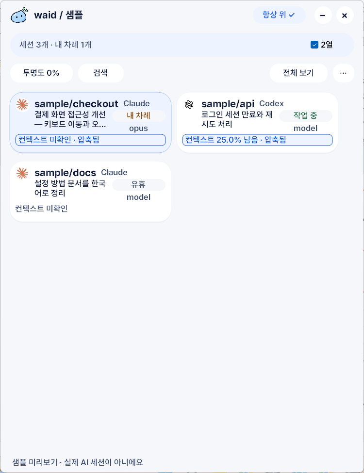
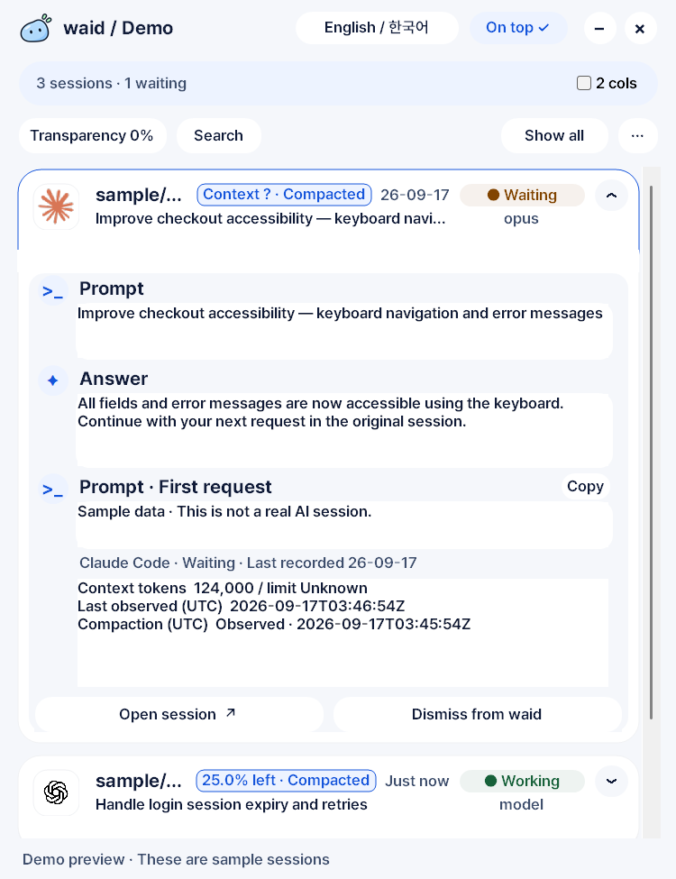

<p align="center">
  <picture>
    <source media="(prefers-color-scheme: dark)" srcset="assets/waid-on-dark.png">
    
  </picture>
</p>

<h1 align="center">waid — what am I doing?</h1>

<p align="center">
  PC에서 돌고 있는 <b>Claude Code</b>·<b>Codex</b> 세션이 각각 무슨 일을 하고 있고, 어느 세션이 내 차례인지 작은 창 하나로 보여줍니다.<br>
  Windows 네이티브 앱. EXE 하나. 로컬 로그만 읽고, 아무것도 밖으로 보내지 않습니다.
</p>

<p align="center">
  <a href="https://github.com/laekhole/what-am-i-doing/releases/latest"><b>Windows용 다운로드</b></a> ·
  <a href="docs/USER_GUIDE.ko.md">사용 안내</a> ·
  <a href="README.md">English</a>
</p>

<p align="center">
  
</p>

## 왜 만들었나

터미널 다섯 개에 코딩 에이전트 다섯 개를 돌려놓았습니다. 그중 하나는 10분 전에 끝나서 내 답을 기다리고 있습니다. 어느 창일까요?

waid는 창을 하나씩 열어보지 않아도 그 답을 줍니다.

- 세션마다 **프로젝트 · 최근 요청 · 에이전트 · 모델 · 상태**를 2초마다 갱신해 보여줍니다.
- **내 차례 / 작업 중 / 유휴 / 오류** 배지와 함께, 트레이 아이콘이 내 차례인 세션 수를 세고 답변이 도착하면 조용히 알립니다.
- **카드를 펼치면** 앱을 전환하지 않고 마지막 요청과 답변을 읽을 수 있습니다. 요청은 클릭 한 번으로 복사합니다.
- 에이전트가 기록한 **남은 컨텍스트**와 압축 여부를 보여줘, 세션이 잊어버리기 전에 알 수 있습니다.
- **검색·필터·고정·숨김·제외**를 지원하고, 연동이 되는 경우 원래 창이나 Orca 세션으로 돌아갑니다.

관찰만 하고 개입하지 않습니다. 에이전트를 실행하거나 프롬프트를 보내거나 대화를 수정하지 않습니다.

<p align="center">
  
</p>

## 설치

**Windows 10/11 x64.** [최신 릴리스](https://github.com/laekhole/what-am-i-doing/releases/latest)에서 `waid-<버전>-windows-x64.exe`를 내려받아 더블클릭하면 됩니다. 설치 프로그램, 런타임, WebView2가 필요 없습니다. 닫기는 트레이로 숨기고, 종료는 트레이 메뉴에 있습니다.

내려받기 전에 알아둘 두 가지:

- **공개된 v0.2.0 EXE는 한국어 UI입니다.** English / 한국어 전환, 트레이 상태 요약, 답변 알림은 현재 소스에 들어 있고 다음 릴리스에 포함됩니다.
- **아직 Authenticode 서명이 없어서** SmartScreen이나 Smart App Control이 실행을 막을 수 있습니다. 릴리스마다 SHA-256 체크섬과 이 저장소의 릴리스 워크플로가 만든 Sigstore 서명이 붙어 있습니다. [검증 방법](docs/USER_GUIDE.ko.md#릴리스-다운로드와-검증)

macOS는 v0.3.0을 목표로 개발 중입니다(네이티브 AppKit, 같은 Rust 코어). 개발용 빌드는 [MACOS.md](MACOS.md)를 참고하세요. Linux는 지금도 CLI를 쓸 수 있습니다.

## 지원 에이전트

| 에이전트 | waid가 읽는 것 | 확인 수준 |
|---|---|---|
| Claude Code, Codex | JSONL 트랜스크립트: 요청·답변·모델·상태·컨텍스트 사용량 | 실제 로그로 대조 |
| Copilot CLI | JSONL 세션 상태 | 합성 데이터만 확인 |
| Cursor | SQLite 상태(읽기 전용): 세션·요청, 턴 상태는 미확인 | 실제 DB 하나 확인 |
| Cline, Roo Code, VS Code Chat, Gemini CLI, opencode, Continue | JSON 세션 파일 | 경로 등록, 실험 단계 |
| Aider, Goose | 프로세스 감지만 | 기록은 읽지 않음 |

상태는 로그 이벤트에서 나옵니다. 에이전트가 로그를 늦게 쓰면 표시도 늦습니다. waid 시작 전부터 활동 중이던 세션은 새 요청이나 응답이 기록될 때까지 **미확인**으로 표시됩니다. 자세한 내용은 [사용 안내](docs/USER_GUIDE.ko.md#에이전트별-지원-범위)에 있습니다.

JSON이나 JSONL 로그를 쓰는 다른 에이전트는 보통 코드 수정 없이 추가할 수 있습니다. [사용자 어댑터](CLI.md#에이전트-추가하기)를 참고하세요.

## 개인정보

- 전부 내 PC 안에서 동작합니다. 통계 수집, 분석, 클라우드 동기화, 계정, API 호출이 없습니다.
- 에이전트 로그는 읽기 전용으로 엽니다. 수정하지 않고, 에이전트에 프롬프트를 보내지 않습니다.
- 설정과 미리보기는 `%LOCALAPPDATA%\waid\settings.json`에 저장됩니다(`WAID_DATA_DIR`로 변경 가능). 요청·답변 텍스트가 들어갈 수 있으니 로그 파일과 같은 수준으로 다루세요.
- 선택 기능인 CLI 대시보드는 `127.0.0.1`에만 바인딩합니다.

정확한 범위와 한계는 [개인정보 보호와 로컬 실행](docs/USER_GUIDE.ko.md#개인정보-보호와-로컬-실행)에 있습니다.

## 진행 상태와 로드맵

| 버전 | 이정표 | 상태 |
|---|---|---|
| v0.2.0 | Windows | 배포됨. 안정화 진행 중. |
| v0.3.0 | macOS | 네이티브 앱 개발 중, Apple Silicon·Intel CI 동작 |
| v0.4.0 | Android + LAN 열람(waidaway) | 계획 |
| v0.5.0 | iOS / iPadOS | 계획 |
| v1.0.0 | 지원 플랫폼 전체 안정화 | 이후 |

혼자 유지관리하는 초기 프로젝트입니다. Windows 버전, 사용한 에이전트, 막힌 단계를 적은 버그 리포트가 가장 큰 도움이 됩니다. [이슈 열기](https://github.com/laekhole/what-am-i-doing/issues)

## CLI

데스크톱 앱은 외부 크레이트 0개인 독립 `waid` 바이너리를 감싼 껍데기입니다. 이 바이너리는 Windows·macOS·Linux에서 동작합니다.

```text
waid                  표를 한 번 출력
waid --waiting        내 차례인 세션만
waid --json --watch   JSON 스냅샷 스트림(schema 2)
waid --html --watch   http://127.0.0.1:7423 로컬 대시보드
waid doctor           세션이 안 보이는 이유 진단
```

플래그, 어댑터, 테마는 [CLI.md](CLI.md)를 참고하세요.

## 소스 빌드

Rust 툴체인과 MSVC 빌드 도구(아이콘 리소스 컴파일러용)가 필요합니다.

```powershell
cargo build --release --locked
cargo build --manifest-path desktop/Cargo.toml --release --locked
.\desktop\target\release\waid-desktop.exe
```

풀 리퀘스트를 열기 전에 두 크레이트에서 `cargo test --release --locked`를 실행하세요. GitHub Actions의 [Windows 검사](.github/workflows/check.yml)와 [macOS 검사](.github/workflows/macos.yml)가 같은 테스트를 돌리고 서명되지 않은 테스트용 EXE를 올립니다.

## 문서

- [사용 안내](docs/USER_GUIDE.ko.md) — 모든 컨트롤, 상태 의미, 세션 복귀 대상, 문제 해결.
- [CLI.md](CLI.md) — 플래그, 사용자 어댑터, HTML 테마.
- [TEMPLATES.md](TEMPLATES.md) — 데스크톱 화면 템플릿.
- [MACOS.md](MACOS.md) — Mac 앱 빌드와 테스트.
- [VALIDATION.md](VALIDATION.md) — 실기에서 확인한 것과 아직 확인하지 않은 것.
- [SIGNING.md](SIGNING.md) — 코드 서명 현황과 계획.
- [DECISIONS.md](DECISIONS.md), [MANIFESTO.md](MANIFESTO.md), [HISTORY.md](HISTORY.md) — 설계 근거와 작업 기록.
- [릴리스 노트](releases/)

## 만든 사람과 라이선스

[laekhole](https://github.com/laekhole)이 만들고 유지관리합니다. Claude(Claude Code)와 GPT(Codex)의 AI 코딩 지원을 받았으며 커밋 트레일러에 기록합니다.

MIT 라이선스. [LICENSE](LICENSE)와 [THIRD_PARTY_NOTICES.txt](THIRD_PARTY_NOTICES.txt)를 참고하세요. 내장 Pretendard 글꼴은 [SIL Open Font License](desktop/assets/fonts/LICENSE.txt)를 따릅니다. 세션 옆에 표시되는 OpenAI·Claude·Orca 마크의 권리는 각 소유자에게 있습니다.
