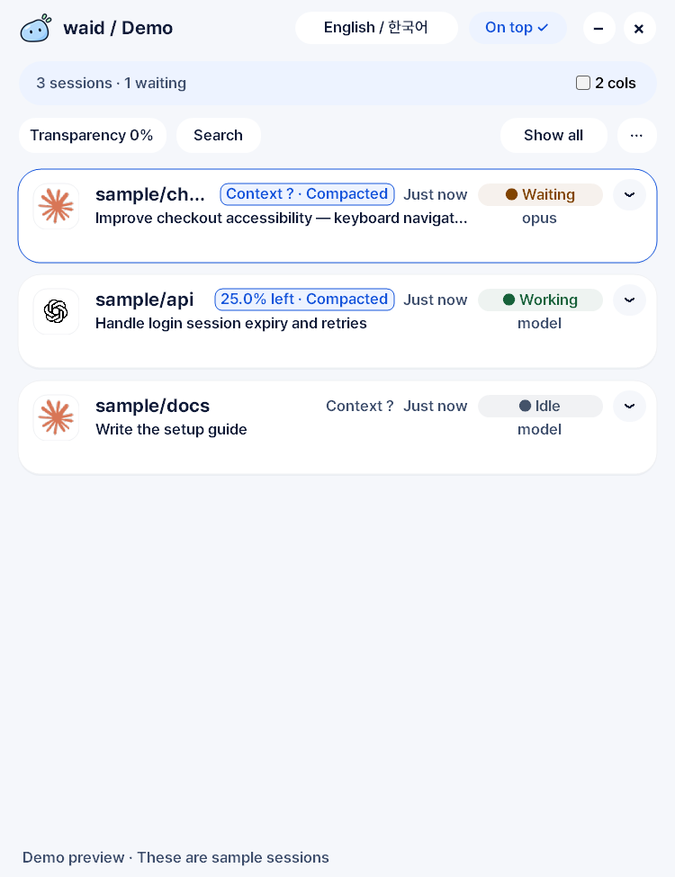

<p align="center">
  <picture>
    <source media="(prefers-color-scheme: dark)" srcset="assets/waid-on-dark.png">
    
  </picture>
</p>

<h1 align="center">waid — what am I doing?</h1>

<p align="center">
  One small window that shows what every <b>Claude Code</b> and <b>Codex</b> session on your PC is doing, and which one is waiting on you.<br>
  Native Windows app. Single EXE. Reads local logs only. Never sends anything anywhere.
</p>

<p align="center">
  <a href="https://github.com/laekhole/what-am-i-doing/releases/latest"><b>Download for Windows</b></a> ·
  <a href="docs/USER_GUIDE.md">User guide</a> ·
  <a href="README.ko.md">한국어</a>
</p>

<p align="center">
  
</p>

## Why

You have five coding agents running in five terminals. One of them finished ten minutes ago and is waiting for you. Which one?

waid answers that without you clicking through every window:

- **Project · latest request · agent · model · status** for every session, refreshed every two seconds.
- **Waiting / Working / Idle / Error** badges, plus a tray icon that counts sessions waiting on you and shows a quiet notification when an answer lands.
- **Expand a card** to read the last prompt and answer without switching apps. Copy the prompt in one click.
- **Remaining context** and compaction evidence when the agent logs them, so you know before the session forgets.
- **Search, filter, pin, hide, dismiss.** Return to the original window or Orca session where the integration supports it.

It observes and never intervenes. waid does not launch agents, send prompts, or edit conversations.

<p align="center">
  
</p>

## Install

**Windows 10/11 x64.** Download `waid-<version>-windows-x64.exe` from the [latest release](https://github.com/laekhole/what-am-i-doing/releases/latest) and double-click it. No installer, no runtime, no WebView2. Close hides it to the tray; Exit is in the tray menu.

Two things to know before you download:

- **The published v0.2.0 EXE has a Korean UI.** The English / 한국어 switch, tray status counts, and reply notifications are in the current source and ship with the next release. Until then, [build from source](#build-from-source) for English.
- **The EXE is not Authenticode-signed yet**, so SmartScreen or Smart App Control may block it. Each release carries a SHA-256 checksum and a Sigstore signature from this repository's release workflow. [How to verify.](docs/USER_GUIDE.md#download-and-verify-a-release)

macOS is in development for v0.3.0 (native AppKit, same Rust core). See [MACOS.md](MACOS.md) to build a development copy. Linux can use the CLI today.

## Supported agents

| Agent | What waid reads | Confidence |
|---|---|---|
| Claude Code, Codex | JSONL transcripts: requests, answers, model, status, context usage | Verified against real logs |
| Copilot CLI | JSONL session state | Fixture-tested only |
| Cursor | SQLite state, read-only: sessions and requests, no turn status | One real database checked |
| Cline, Roo Code, VS Code Chat, Gemini CLI, opencode, Continue | JSON session files | Path registered, experimental |
| Aider, Goose | Process detection only | No history read |

Status is derived from log events. If an agent writes its log late, waid shows the change late. Sessions that were active before waid started show **Unknown** until a new request or response is logged. Full details in the [user guide](docs/USER_GUIDE.md#agent-support).

Adding another agent that writes JSON or JSONL usually needs no code: see [custom adapters](CLI.md#에이전트-추가하기).

## Privacy

- Runs entirely on your machine. No telemetry, analytics, cloud sync, accounts, or API calls.
- Opens agent logs read-only. Never modifies them, never sends prompts to agents.
- Settings and previews live in `%LOCALAPPDATA%\waid\settings.json` (override with `WAID_DATA_DIR`). They can contain prompt and answer text, so treat that file like your logs.
- The optional CLI dashboard binds to `127.0.0.1` only.

Details and the exact limits are in [Privacy and local operation](docs/USER_GUIDE.md#privacy-and-local-operation).

## Status and roadmap

| Version | Milestone | Status |
|---|---|---|
| v0.2.0 | Windows | Released. Stabilization continues. |
| v0.3.0 | macOS | Native app in development, CI on Apple Silicon and Intel |
| v0.4.0 | Android + LAN viewing (waidaway) | Planned |
| v0.5.0 | iOS / iPadOS | Planned |
| v1.0.0 | Stable across supported platforms | Future |

This is an early project by a single maintainer. Bug reports with your Windows version, agent, and the step that failed are the most useful thing you can send. [Open an issue](https://github.com/laekhole/what-am-i-doing/issues).

## CLI

The desktop app is a shell around an independent `waid` binary with zero external crates. It works on Windows, macOS and Linux.

```text
waid                  Print a table once
waid --waiting        Only sessions waiting on you
waid --json --watch   Stream JSON snapshots (schema 2)
waid --html --watch   Local dashboard at http://127.0.0.1:7423
waid doctor           Explain why a session is missing
```

See [CLI.md](CLI.md) for flags, adapters, and themes.

## Build from source

Requires a Rust toolchain and the MSVC build tools (for the icon resource compiler).

```powershell
cargo build --release --locked
cargo build --manifest-path desktop/Cargo.toml --release --locked
.\desktop\target\release\waid-desktop.exe
```

Run `cargo test --release --locked` in both crates before opening a pull request. With Node.js installed, run `node tests/dashboard.cjs` for dashboard refresh checks. `desktop/test-package.ps1` checks Windows package versions, checksums and overwrite protection after building. The GitHub Actions [core and Windows checks](.github/workflows/check.yml) test the Linux core and Windows app; [macOS checks](.github/workflows/macos.yml) cover both Mac architectures. Native build artifacts are unsigned or ad-hoc signed development packages.

## Documentation

- [User guide](docs/USER_GUIDE.md) — every control, status meaning, session-return target, and troubleshooting step.
- [CLI.md](CLI.md) — flags, custom adapters, HTML themes.
- [TEMPLATES.md](TEMPLATES.md) — desktop appearance templates.
- [MACOS.md](MACOS.md) — building and testing the Mac app.
- [VALIDATION.md](VALIDATION.md) — what has been verified on real machines and what has not.
- [SIGNING.md](SIGNING.md) — code-signing status and plan.
- [DECISIONS.md](DECISIONS.md), [MANIFESTO.md](MANIFESTO.md), [HISTORY.md](HISTORY.md) — design rationale and work log (Korean).
- [Release notes](releases/)

## Credits and license

Created and maintained by [laekhole](https://github.com/laekhole), with AI coding assistance from Claude (Claude Code) and GPT (Codex), credited in commit trailers.

MIT License. See [LICENSE](LICENSE) and [THIRD_PARTY_NOTICES.txt](THIRD_PARTY_NOTICES.txt). Bundled Pretendard fonts are under the [SIL Open Font License](desktop/assets/fonts/LICENSE.txt). The OpenAI, Claude and Orca marks shown beside sessions belong to their owners.
